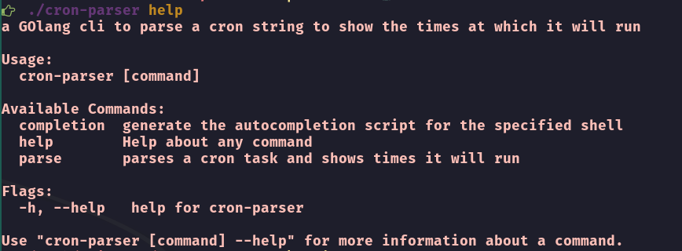
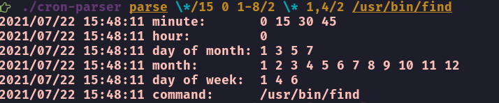

# Cron Parser
A golang cli to parse cron job input.

## How to install
- Download package from [releases](https://github.com/omaressameldin/cron-parser/releases/)
- Set the binary to be executable `chmod +x cron-parser`
### Or
- Install [GO version manager](https://github.com/stefanmaric/g)
- Install GO 1.16 => `g install 1.16.4`
- Set version to 1.16 => `g set 1.16.4`
- Clone repo and navigate to root of repo
- Build package `go build .`

## How to use
- **There are 2 commands available in the app:**
  - help:
      - for showing useful info about available commands`
      - **example:** `cron-parse help`
  
  - parse:
    - for parsing cron jobs
    - **example:** `./cron-parser parse \*/15 0 1-8/2 \* 1,4/2 /usr/bin/find`
  

## Improvements
- The code could use a better structure.
- Regex matching could have been used to validate the command.

## packages used
- [os/exec](https://golang.org/pkg/os/exec/)
- [Cobra](https://github.com/spf13/cobra#flags)
